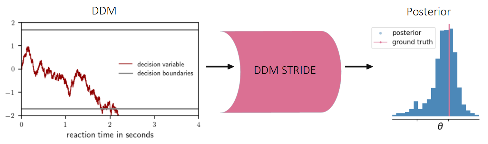
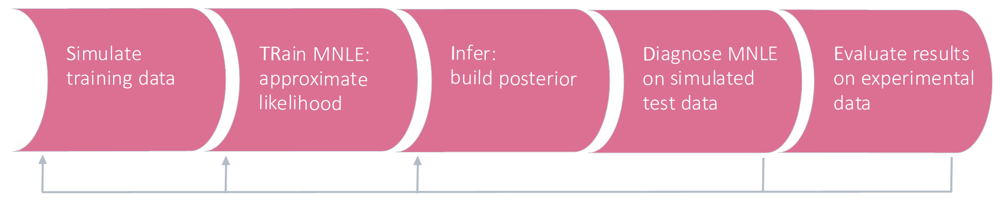

# DDM STRIDE

DDM STRIDE implements a pipeline for applying simulation-based inference to Drift-Diffusion Models.

Drift-Diffusion models (DDMs) are used in psychology and neuroscience for modelling the process of decision making in humans and animals. Interesting applications of DDMs include [capturing the effect of medication in ADHD patients](https://link.springer.com/article/10.3758/s13423-016-1199-y) or investigating the [relation between visual attention and choice](https://www.frontiersin.org/articles/10.3389/fpsyg.2012.00193/full). A simple DDM is visualized in the figure below. The model computes the progress of a decision variable over time towards one of two decision boundaries. When the decision variable crosses one of the boundaries, the corresponding choice is reported and the reaction time of making the choice can be observed. A DDM is parameterized by a number of parameters $\theta$, e.g. the height of the decision boundary.  

Given experimental data containing the choices and reaction times of subjects, reasearchers aim at finding the DDM and the DDM parameters $\theta$ that are most likely to having generated the experimental data. Parameters can be found via [Bayesian Inference](https://en.wikipedia.org/wiki/Bayesian_inference). Here, a posterior $p(\theta | x)$ is computed that describes the probability of a parameter $\theta$ generating the experimental data $x$. Additionally, experimental conditions $\pi$ like the task difficulty might influence the DDM, yielding a posterior distribution $p(\theta | x, \pi)$. The shape and variance of the posterior convey information regarding the sensitivity of a parameter and can help with defining a reasonable prior space. Furthermore, the variance of the posterior reflects on its uncertainty with an increased number of observations $x$ decreasing the posterior variance.  

For simpler DDMs the posterior can be found by numerically solving the likelihood $p(x | \theta, \pi)$. However, the likelihood is intractable for more complex DDMs like the [leaky, competing accumulator model](https://psycnet.apa.org/record/2001-07628-003). DDM STRIDE provides a pipeline for solving complex DDMs based on simulations, cf. [simulation-based inference](https://www.pnas.org/doi/abs/10.1073/pnas.1912789117). 




The pipeline is run from the command line via 
```
python ddm_stride/run.py
```
or via the tutorials.    

The [quickstart tutorial](https://github.com/mackelab/ddm_stride/blob/main/tutorials/quickstart.ipynb) shows one pipeline run and its results. In order to use the pipeline, complete the tutorials one after the other. They are also made available in [Google Colab](https://drive.google.com/drive/folders/1ienzlueWtA38DEyD6ig4bgPlXXGau2QW?usp=sharing).  
Blue boxes provide additional information for more advanced users and can be skipped. 

</br>
The five pipeline stages are run one after the other, as depicted in the following figure: </br>



The **Simulate** stage implements a DDM as a simulator. This simulator generates observations $x$ (e.g. a reaction time and a choice). To generate one observation,  parameters $\theta$ and optionally experimental conditions $\pi$ must be passed to the simulator. Sensible values for $\theta$ and $\pi$ are drawn from a proposal distribution that is specified by the user. $x$,  $\theta$ and $\pi$ are used as training and test data for the following stages.
See [tutorial 2](https://github.com/mackelab/ddm_stride/blob/main/tutorials/tutorial_2_simulate.ipynb) for a detailed explanation of how to run the simulation step.

The **TRain** stage utilizes the training data to train a neural network called [Mixed Neural Likelihood Estimator](https://www.biorxiv.org/content/10.1101/2021.12.22.473472v2.abstract) (MNLE). The MNLE is trained to emulate the behaviour of the simulator, hereby learning a synthetic likelihood $q(x | \theta, \pi)$ that approximates the true likelihood $p(x | \theta, \pi)$.
See [tutorial 3](https://github.com/mackelab/ddm_stride/blob/main/tutorials/tutorial_3_train.ipynb) for a detailed explanation of how to train a MNLE.

The **Infer** stage specifies the posterior method. [Markov chain Monte Carlo](https://en.wikipedia.org/wiki/Markov_chain_Monte_Carlo) (MCMC) methods allow to draw samples $\Theta$ with a probability that depends on the synthetic likelihood $q(x | \theta, \pi)$ and the prior $p(\theta)$. Since likelihood and prior are proportional to the posterior, i.e. $p(\theta | x, \pi) \propto q(x | \theta, \pi) \cdot p(\theta)$, the samples over time approximate the posterior distribution.
See [tutorial 4](https://github.com/mackelab/ddm_stride/blob/main/tutorials/tutorial_4_infer.ipynb) for a detailed explanation of how to specify the posterior.

The **Diagnose** stage verifies if the MNLE has been trained successfully, i.e. if it has learned the synthetic likelihood and can be leveraged by the posterior method in order to infer the posterior. Various diagnostics are computed and visualized. If the results of the **Diagnose** stage are unsatisfactory, stages 1-3 can be adapted to improve the posterior.
See [tutorial 5](https://github.com/mackelab/ddm_stride/blob/main/tutorials/tutorial_5_diagnose.ipynb) for a detailed explanation of how to run and interpret the diagnostics.

The **Evaluate** stage finally infers the posterior of parameters $\theta$ on an experimental dataset. Posterior metrics like the median, maximum a posteriori estimate or variance are provided. Additionally, various plots are created allowing the user to investigate if the selected DDM is able to explain the experimental data.
See [tutorial 6](https://github.com/mackelab/ddm_stride/blob/main/tutorials/tutorial_6_evaluate.ipynb) for inferring the posterior distribution on an experimental dataset.


[Tutorial 7](https://github.com/mackelab/ddm_stride/blob/main/tutorials/tutorial_7_reuse_results.ipynb) shows how to reuse previously computed results, e.g. to use a trained MNLE to infer the posterior on multiple different experimental datasets.

The pipeline is managed via the configuration files found in the *config* folder and organized into three subfolders. The files in the subfolder *config/algorithm* specify the MNLE. *config/ddm_model* defines the Drift-Diffusion model that will be used as a simulator. The *config/task* files contain configurations of different pipeline runs, e.g. the number of simulations, the posterior specification or the name of the experimental dataset.  
The results of each pipeline run are saved to the *results* folder. See the [first tutorial](https://github.com/mackelab/ddm_stride/blob/main/tutorials/tutorial_1_config.ipynb) for a detailed explanation of configuration files.


# Installation

DDM STRIDE uses python 3.9 or higher. You might want to install the package in a virtual environment, e.g. [conda](https://docs.conda.io/en/latest/) or [pipenv](https://pypi.org/project/pipenv/).

You can either install the package via 
```
pip install ddm_stride
```
of clone the package from gitlab and run 
```
pip install -e . / 
```

# Creating an issue

To report a bug, provide feedback or suggest an extension, please create an [issue](https://github.com/mackelab/ddm_stride/issues).

# Acknowledgements

DDM STRIDE is built on the [sbi](https://github.com/mackelab/sbi) package that is provided by the [mackelab](https://uni-tuebingen.de/en/research/core-research/cluster-of-excellence-machine-learning/research/research/cluster-research-groups/professorships/machine-learning-in-science/).

# License

[Affero General Public License v3 (AGPLv3)](https://www.gnu.org/licenses/)

# Citation

```
@mastersthesis{wenger_ddm_stride,
  author  = "Ingeborg Wenger",
  title   = "DDM STRIDE: A pipeline for the application of simulation-based inference on Drift-Diffusion Models",
  school  = "University of Tuebingen",
  year    = 2022,
  address = "Tuebingen, Germany",
  month   = may
}
```